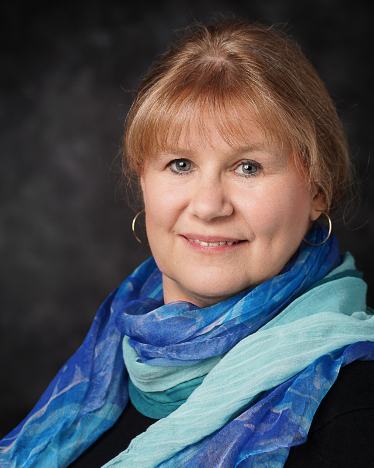

.. |Cm| replace:: Curriculum
.. |Inl| replace:: Instructional

.. contents::

#####################
TRACY L. RUSCH
#####################

.. LIST-TABLE::
    :widths: 25 25 25 25
    :header-rows: 1

    * - E-Mail
      - Phone
      - Website
      - LinkedIn
    * - TLRusch@mac.com
      - 603.714.9337 
      - Triangle Writing Website
      - LinkedIn Profile
    * -   
      -   
      - https://www.trianglewriting.com
      - https://www.LinkedIn.com/in/TracyRusch/
      
`Alternate Hyperlink Coding:`

`Triangle Writing Website`_
`LinkedIn Profile`_

.. _Triangle Writing Website: https://www.trianglewriting.com
.. _LinkedIn Profile: https://www.LinkedIn.com/in/TracyRusch/

================
POSITION SOUGHT
================

.. LIST-TABLE::
    :widths: 50 50

    * - * Technical Writing
      - * Technical Writer
    * - * |Inl| Design
      - * |Inl| Designer
    * - * |Cm| Development
      - * |Cm| Developer
    * - * Project Management
      - * Project Manager
    * - * Math Teacher
      - * Mathematics Teacher

=============================
10+ YEARS OF EXPERIENCE AS:
=============================
#. Technical writer within the roles of educator, writer, administrator, and project manager in academia;
#. Writer for audiences at all levels of knowledge and sophistication;
#. Professor, Teacher and Workshop/Seminar Presenter for audiences at all levels of knowledge and sophistication.

================================
10+ YEARS DOING THE FOLLOWING:
================================

#. **Writing:**  Communicating complex concepts in understandable, user-friendly written language; 
#. **Presentations:**  Communicating complex concepts in understandable, user-friendly oral presentations, courses, seminars, and workshops; 
#. **Curriculum and Instructional Documents:**  Develop, Create, Write, Implement;
#. **On-Line Courses and Workshops:**  Develop, Create, Write, Teach, Assess, Evaluate; 
#. **Self-Guided Learning, Instruction, and Curriculum:**  Design, Develop, Create, Write, Documentation.
#. **Mathematics, Statistics**

============
EMPLOYMENT
============

**2018 to Present** 
    Career Change to Technical Writing
        * Writer for Ask Wonder
        * Technical Writing Certificate

**2015 to 2018**
    High School Math Teacher (Contract & Long-Term Substitute) 
            * Derryfield School (Manchester NH)
            * Pinkerton Academy (Derry NH)
            * Block Island School (New Shoreham, RI)

**2011 to 2015**
    University Accreditation Consultant & Project Manager 
        * Wentworth Institute of Technology, Boston, MA
        * Tufts University, Medford, MA

**2006 to 2015**
    * GentleMath Tutoring & Professional Development
    * Math Tutor K-16:  
        Private Students, Landmark College, Bedford, NH High School, Milford, NH High School 
    * Math Teacher for Homebound Students
        Tantasqua Regional High School, Sturbridge, MA
    * Math Interventionist Teacher for Public Schools
        Portsmouth, NH

**1997 to 2006**
    * University Assistant Professor, Mathematics Education
        Wright State University, Dayton, Ohio,1999-2006
    * University Assistant Professor, Mathematics Education
        University of NH, Durham, Post-Doc, 1997-1999

======================
TECHNOLOGY AND TOOLS
======================

    * Mathematics, Statistics
    * All Microsoft Office Applications - Expert
        Review Tracking, Equation Editor, Graphics Editor in Word
    * Slack, GitHub
    * HTML, XML, RTD, CSS, DITA, DocBook
    * Join.Me, GoToMeeting, Skype
    * Sphinx, ReadtheDocs
    * Madcap Flare, Camtasa, Adobe Suite

================
CERTIFICATIONS
================

    * Middlesex Technical Writing Certificate (May 2019)
    * Teaching Licenses for NH and MA:  
        All math content through advanced calculus and statistics;
        Highly Qualified for Mathematics Teaching, New Hampshire and Massachusetts;
    * School District Leadership and Performance Assessment
        Broad Institute & Harvard Graduate School of Education.

===========
EDUCATION
===========

* PhD	Mathematics Education, University of Texas, Austin, TX;
* BA +9 Mathematics (course equivalent), University of Texas, Austin, TX;
* MA 	Curriculum & Instruction (Math), California State University, Sacramento, CA;
* BS 	Education (Math & Science), Boston University, Boston, MA;

=============
ACHIEVEMENTS
=============

#. Redesigned college mathematics curriculum to meet the needs of at risk students that resulted in a dramatic increase in the number of students who:

   * Passed the courses and mastered the math with confidence;
   * Were retained through graduation; and 
   * Pursued and completed majors in STEM fields.

#. Successfully drove over twenty large and complex projects to completion on time, on budget.  Projects included: 

   * A two-year, 200 human subject research study that resulted in important insights and program improvements; 
   * An 18-month accreditation project leading to a 10-year accreditation approval for over 100 degree programs at a major university; and
   * A six-month project to revise curriculum for multiple colleges and universities that led to improved math instruction.

#. Skillfully managed major change projects that resulted in a smooth transition to the desired outcomes with strong employee buy in.  Strategies included:

   * Thoughtful diplomacy to overcome initial resistance and in some cases outright hostility; 
   * Comfortable working relationships with all personnel from upper level management to support staff; 
   * Clear, precise oral and written communication; and 
   * Sufficiently advanced knowledge to work intelligently with a broad range of subject matter experts.

#. Leader in the movement to improve K-12 mathematics curriculum that included revising standards, presentations at national and international conferences, multiple publications, and creation of new undergraduate and graduate teacher education courses.

.. note:: There are more Achievements listed in the complete CV.

.. caution:: Don't tease the animals.

.. only:: Administrators

TUFTS UNIVERSITY
Independently initiated and managed a complex 18-month project culminating in the College of Arts & Sciences (A&S) assessment report that resulted in a ten-year accreditation approval.  

.. only:: Teachers

WRIGHT STATE UNIVERSITY:  
Managed multiple responsibilities and projects simultaneously, including curriculum development, teaching, formal research, grant proposals, writing for publication, and community service.

    ** END **
